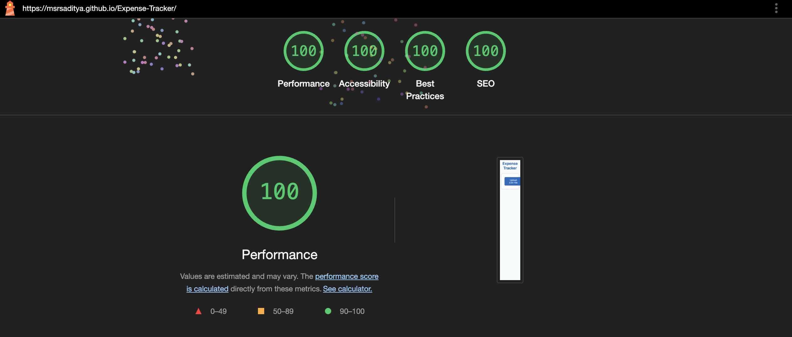

# Expense Tracker

Track your expenses seamlessly.

## Allowed and Recommended CSV Format

```csv
Date,Name,Amount,Type
```

Example:

Date: 01-05-2025

Name: John Doe

Amount: 1000

Type: Credit

- Type can be either "Credit" or "Debit" (nothing else)
- Date should be DD-MM-YY

## 💯 LightHouse

